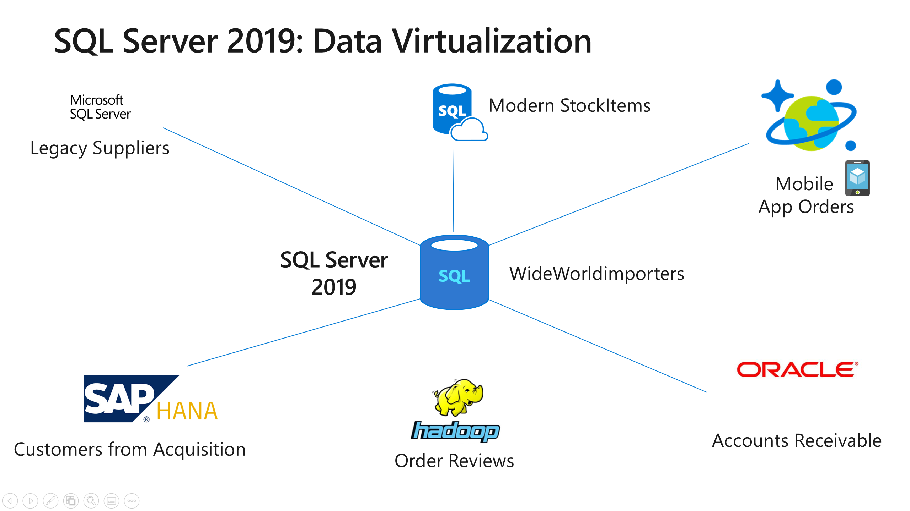
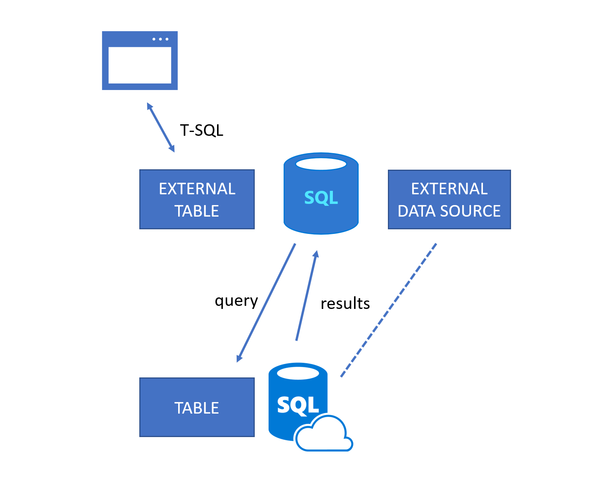
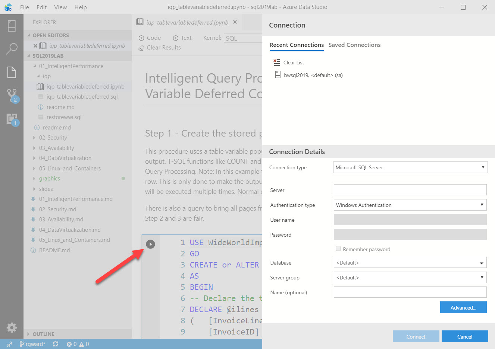

# Workshop: SQL Server 2019 Lab CTP 3.1

#### <i>A Microsoft workshop from the SQL Server team</i>

<p style="border-bottom: 1px solid lightgrey;"></p>

 <h2>SQL Server 2019 Data Virtualization</h2>

SQL Server 2019 includes new capabilities for data virtualization by extending the Polybase (nicknamed it Polybase++) feature introduced in SQL Server 2016 with the ability to connect to other data sources with **client drivers installed**:

- SQL Server
- Oracle
- Teradata
- MongoDB

In addition for SQL Server 2019 on Windows, Polybase now supports the ability to connect to any ODBC data source such as MySQL, PostgreSQL, SAP HANA, IBM DB2, or even Excel.

SQL Server 2019 Polybase still supports connectivity to Hadoop systems as it did in SQL Server 2016 and 2017. In addition. SQL Server 2019 **Big Data Clusters** provide an integrated data virtualization solution in a Kubernetes cluster.

You'll cover the following topics in this Module:

<dl>

  <dt><a href="#4-0">4.0 SQL Server 2019 Polybase</a></dt>
   
</dl>

<p style="border-bottom: 1px solid lightgrey;"></p>

<h2><a name="4-0">4.0 SQL Server 2019 Polybase</a></h2>

In this module you will learn about the enhanced Polybase feature of SQL Server 2019 designed to meet the needs of the modern data platform.

<p><b><a name="challenge">The Challenge</a></b></p>

Organizations often today have multiple database providers and sources that they must integrate together. SQL Server is a leading industry data platform so many customers move data from other data sources into SQL Server often using Extract, Transform, and Load (ETL) applications. ETL applications can be costly to build and maintain and often results in latencies to access data external to SQL Server.

Consider all the data sources facing a company like WideWorldImporters



Traditionally, WideWorldImporters would have to write ETL jobs to move data from all these sources into SQL Server. While that solution still may be best for this company, what if SQL Server could act as a "data hub" for all of these sources? What if you could develop T-SQL queries and execute them against SQL Server 2019, and SQL Server would query the external data sources to bring back the results? Imagine if you could join local SQL Server tables with external data sources or perhaps join all of these together!

<p><b><a name="solution">The Solution</a></b></p>

The questions just asked are in a nutshell what Polybase provides in SQL Server 2019 through a concept called an **EXTERNAL TABLE**.

External tables are just like SQL Server tables except SQL Server only stores the metadata of the table definition. The data stays where it lives from the external data source. Think of an external table like a view on top of a data source outside of SQL Server. Since an external table is like a table, you can use SQL Server securables to control access to external data sources like you would a local table.

Polybase uses ODBC drivers to connect to sources such as Oracle, Teradata, MongoDB, and SQL Server. And the driver to connect to other SQL Server data sources can be used to connect to Azure SQL Database and Azure SQL Data Warehouse. With SQL Server 2019 on Windows, you can "bring your own driver" and connect to almost any ODBC data source in your environment. Polybase is integrated with the SQL Server engine so the query processor can make smart decisions to "push-down" query predicates instead of streaming back an entire remote table and filtering it locally.

Consider this simple diagram for how external tables work



An application runs a T-SQL query against an EXTERNAL TABLE. The EXTERNAL TABLE is mapped to an EXTERNAL DATA SOURCE which points to the location of the external data source (in this diagram imagine this is Azure SQL Database). SQL Server will take the query against the EXTERNAL TABLE and produce a new query native to the external data source. Results are brought back to SQL Server and produced back to the application.

Polybase has advantages over features like linked servers such as:

- External tables are defined in the database so are naturally part of an Availability Group
- External tables allow you to define your table and column names per your organization standard vs using object names from the external data source
- Polybase has built-in scalability through a concept called a scale-out group.
- Polybase has built-in client driver support for Hadoop, Oracle, Teradata, and MongoDB.

You can read more about a comparison of Polybase to Linked Servers at https://docs.microsoft.com/en-us/sql/relational-databases/polybase/polybase-faq?view=sql-server-ver15.

Proceed to the Activity to learn an example of how to use Polybase with SQL Server 2019 and Azure SQL Server Database.

<p style="border-bottom: 1px solid lightgrey;"></p>

<p><b><a name="activityadr">Activity: Using Polybase with Azure SQL Server Database</a></b></p>

In this activity, you will learn how to build an external data source and table to query a table in Azure SQL Database without connecting directly yourself.

**NOTE**: *If at anytime during the Activities of this Module you need to "start over" you can go back to the first Activity in 4.0 and run through all the steps again.*

**NOTE**: *There are example scripts in **sql2019lab\04_DataVirtualization** for other data sources for you to use at a later time for Hadoop, Oracle, CosmosDB (through MongoDB), SQL Server 2008R2, and SAP HANA. For these examples, you will need to create or use your own external data source. The scripts and directions to create table definitions, data, and external tables are included.*

<p><b><a name="activitysteps">Activity Steps</a></b></p>

Go through the following steps to learn how to query tables in Azure SQL Database using Polybase.

All scripts for this activity can be found in the **sql2019lab\04_DataVirtualization\sqldatahub\azuredb** folder.

**IMPORTANT**: This activity assumes the following:

- You have installed and enabled Polybase (stand-alone is acceptable) per the documentation at https://docs.microsoft.com/en-us/sql/relational-databases/polybase/polybase-installation?view=sqlallproducts-allversions or for Linux at https://docs.microsoft.com/en-us/sql/relational-databases/polybase/polybase-linux-setup.
- You have access to an Azure SQL Database database or Managed Instance. The T-SQL script **createazuredbtable.sql** as found in the sql2019lab\04_DataVirtualization\sqldatahub\azuredb directory contains the target schema and data. The scripts in the activity have a specific Azure SQL Database connection string, login, password, and database name (wwiazure). You may need to modify the scripts to match your Azure SQL Database connection, login, password, and db name.

**STEP 1: Restore the WideWorldImporters backup.**

If you have restored the WideWorldImporters database backup in previous modules, you can skip this step.

Execute the T-SQL script **restorewwi.sql** as found in the **sql2019lab\04_DataVirtualization** folder to restore the WideWorldImporters backup. The script assumes a specific path for the backup and database/log files. You may need to edit this depending on your installation. *Remember for Linux installations, the default path is /var/opt/mssql/data.* Your instructor may have provided this backup for you but if necessary you can download it from https://github.com/Microsoft/sql-server-samples/releases/download/wide-world-importers-v1.0/WideWorldImporters-Full.bak

**STEP 2: Clean up any previous execution**

Use the T-SQL script **cleanup.sql** from the **sql2019lab\04_DataVirtualization\sqldatahub\azuredb** folder to clean up any previous execution of this activity. If you get errors that the objects don't exist you can safely ignore them because it means you have not run the activity before.

```sql
USE [WideWorldImporters]
GO
DROP EXTERNAL TABLE azuresqldb.ModernStockItems
GO
DROP SCHEMA azuresqldb
GO
DROP EXTERNAL DATA SOURCE AzureSQLDatabase
GO
DROP DATABASE SCOPED CREDENTIAL AzureSQLDatabaseCredentials
GO
DROP MASTER KEY
GO
```
**STEP 3: Use a T-SQL notebook to complete the rest of the activity.**

T-SQL notebooks provide a very nice method to execute T-SQL code with documentation in the form of markdown code. All the steps and documentation to complete the rest of the activity for Module 4.0 can be found in the T-SQL notebook **azuredbexternaltable.ipynb** which can be found in the **sql2019lab\04_DataVirtualization\sqldatahub\azuredb** folder.

**NOTE**: *A T-SQL script **azuredbexternaltable.sql** is also provided if you want to go through the same steps as the notebook but use a tool like SQL Server Management Studio*.

T-SQL notebooks can be executed with Azure Data Studio. If you are familiar with using Azure Data Studio and T-SQL notebooks open up the **azuredbexternaltable.ipynb** notebook and go through all the steps. When you are done proceed to the **Activity Summary** section for the Activity below.

If you have never opened a T-SQL notebook with Azure Data Studio, use the following instructions:

Launch the Azure Data Studio application. Look for the icon similar to this one:

<p>

The first time you launch Azure Data Studio, you may see the following choices. For the purposes of this workshop, select No to not load the preview feature and use x to close out the 2nd choice to collect usage data.
    
<p>

You will now be presented with the following screen to enter in your connection details for SQL Server. Use connection details as provided by your instructor to connect to SQL Server or the connection you have setup yourself for your SQL Server instance.

Now click the **Connect** button to connect. An example of a connection looks similar to this graphic (your server, Auth type, and login may be different):

<p>

A successful connection looks similar to this (your server may be different):


If you haven't already used Explorer in Azure Data Studio, it can be used to explore files. Use the power of Azure Data Studio Explorer to open up any file including notebooks. Use the File/Open Folder menu to open up the **sqlworkshops\sql2019lab** folder. Now click the Explorer icon on the left hand side of Azure Data Studio to see all files and directories for the lab. Navigate to the **04_DataVirtualization\sqldatahub\azuredb** folder, open up the **azuredbexternaltable.ipynb** notebook and go through all the steps. You can now use Azure Data Studio explorer to open up a notebook or script without exiting the tool.


When you start using a notebook and use the "Play" button of a cell, you may get prompted for the connection. Choose the connection you used when you first opened up Azure Data Studio.



There is additional documentation on how to use SQL notebooks at https://docs.microsoft.com/en-us/sql/azure-data-studio/sql-notebooks. 

When you are done proceed to the **Activity Summary** section for the Activity below.

<p><b><a name="activitysummary">Activity Summary</a></b></p>

In this activity you have learned how Polybase in SQL Server 2019 allows you to connect and query data from external data sources without moving data using ETL applications. In the Activity you learned how to create and query an EXTERNAL DATA SOURCE and EXTERNAL TABLE mapped to an Azure SQL Database table.

Proceed to the next module to learn about enhancements to **SQL Server Linux and Containers** in SQL Server 2019.

<p style="border-bottom: 1px solid lightgrey;"></p>

<p><b>For Further Study</b></p>

- [What is Polybase?](https://docs.microsoft.com/en-us/sql/relational-databases/polybase/polybase-guide)

- [CREATE EXTERNAL TABLE](https://docs.microsoft.com/en-us/sql/t-sql/statements/create-external-table-transact-sql)
 
- [What are SQL Server Big Data Clusters?](https://docs.microsoft.com/en-us/sql/big-data-cluster/big-data-cluster-overview)

- [What is Azure Data Studio?](https://docs.microsoft.com/en-us/sql/azure-data-studio/what-is)

- [How to use Notebooks in Azure Data Studio](https://docs.microsoft.com/en-us/sql/azure-data-studio/sql-notebooks)

<p style="border-bottom: 1px solid lightgrey;"></p>

<p><b >Next Steps</b></p>

Next, Continue to <a href="05_Linux_and_Containers.md" target="_blank"><i>Linux and Containers</i></a>.
